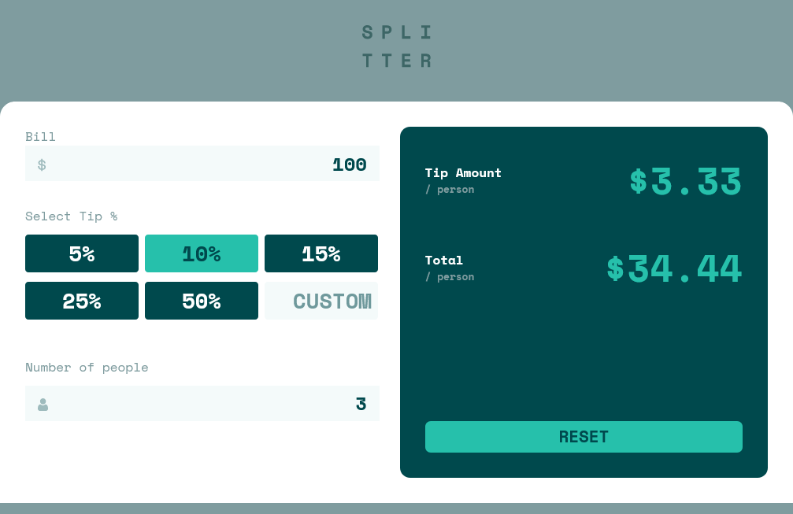
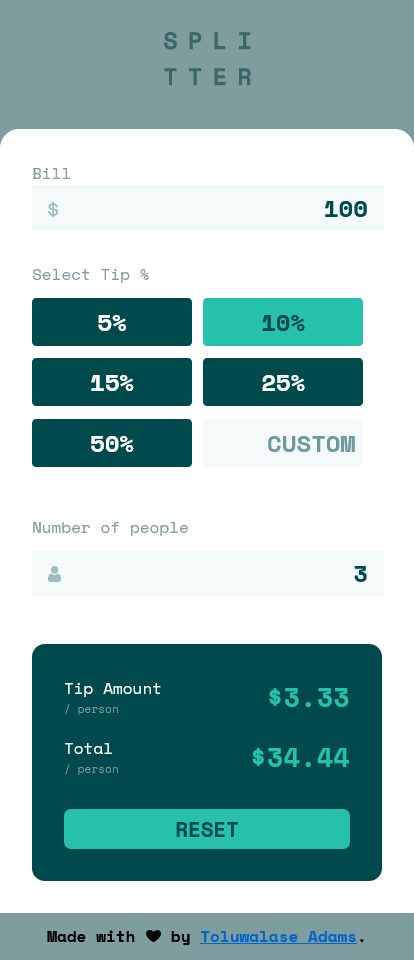

# Frontend Mentor - Tip calculator app solution

This is a solution to the [Tip calculator app challenge on Frontend Mentor](https://www.frontendmentor.io/challenges/tip-calculator-app-ugJNGbJUX) by Toluwalase Adams.

## Table of contents

- [Overview](#overview)
  - [The challenge](#the-challenge)
  - [Screenshot](#screenshot)
  - [Links](#links)
- [My process](#my-process)
  - [Built with](#built-with)
  - [What I learned](#what-i-learned)
- [Author](#author)

## Overview

### The challenge

Users should be able to:

- View the optimal layout for the app depending on their device's screen size
- See hover states for all interactive elements on the page
- Calculate the correct tip and total cost of the bill per person

### Screenshot




### Links

- Solution URL: [Add solution URL here](https://your-solution-url.com)
- Live Site URL: [Add live site URL here](https://your-live-site-url.com)

## My process

Started the project by creating the `HTML` file and created the structural markup using semantic elements.

Created the `CSS` file and removed initial margin and padding from the page. Proceeded to create a mobile-first webpage. Used `Grid` and `Flexbox` to make the layouts. Added the colors to the page and also set the properties for hovered and focused elements. Made the page responsive on desktop screens.

Made the website functional with `Javascript` where I parsed the input values and calculated the tip values with them. Also added the option of a custom percentage. Made an error message display on the screen when users' input of persons is less than 1. Lastly, made a reset feature for users to reset the values showed on screen without having to reload the page.

### Built with

- Semantic HTML5 markup
- CSS custom properties
- Flexbox
- CSS Grid
- Mobile-first workflow
- Vanilla javascript

### What I learned

I learned how to remove the default arrows in the number input on major browsers.

```css
/* Remove arrow buttons on number input on Chrome and Safari */

input::-webkit-outer-spin-button,
input::-webkit-inner-spin-button {
    -webkit-appearance: none;
    margin: 0;
}

input[type=number] {
    -moz-appearance:textfield; /*Removes it on Firefox */
}
```


I also learned a real world use case of the `forEach` method when I used it to show the active tip when it was clicked.

```js
tips.forEach(function (val){
        val.classList.remove("active-tip");
        if (event.target.innerHTML == val.innerHTML){
            val.classList.add('active-tip');
            tipValue = parseFloat(val.innerHTML)/100;
        }
    })
}
```

## Author

### Toluwalase Adams
- Twitter - [@tolufbg](https://www.twitter.com/tolufbg)

